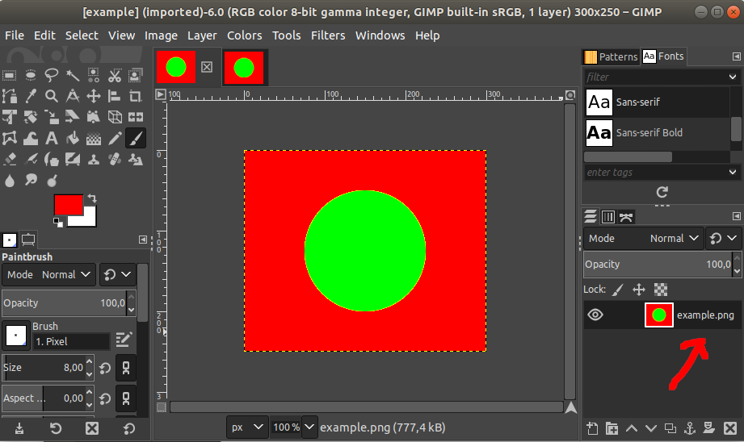

# Describes issues with loading DDS files not power-of-two sizes

Issue with sprites and .dds files which is not power-of-two sizes:

There are two files(300px*250px):<br>
source [example.png](creating_sprites/example.png):



and generated [example.dds](creating_sprites/example.dds):


They look similar in GIMP(or other editors) 

But is they are loaded in pyglet - following picture could be seen([draw_dds_not_power_of_two.py](creating_sprites/draw_dds_not_power_of_two.py)):


And here is example with using such files in 3d render([draw_3d.py](creating_sprites/draw_3d.py)):

 

Related folder - [creating_sprites](creating_sprites)<br>
Related files:<br>
[draw_dds_not_power_of_two.py](creating_sprites/draw_dds_not_power_of_two.py)<br>
[draw_3d.py](creating_sprites/draw_3d.py)
***
#### Below issue is resolved in 1.4.5 pyglet version
Issue link - https://github.com/pyglet/pyglet/issues/69

### create_files_from_png.py
Describes how `.dds` files were created

### pyglet_load_files.py
Produces following exceptions:

```
Try to open file static_dist/32_32.dds
Successfully loaded.

Try to open file static_dist/31_21.dds
Traceback (most recent call last):
  File "pyglet_load_files.py", line 9, in try_to_load_file
    pyglet.image.load(path)
  File "<path>/v_pyglet/lib/python3.6/site-packages/pyglet/image/__init__.py", line 198, in load
    image = decoder.decode(file, filename)
  File "<path>/v_pyglet/lib/python3.6/site-packages/pyglet/image/codecs/dds.py", line 223, in decode
    'GL_EXT_texture_compression_s3tc', decoder)
  File "<path>/v_pyglet/lib/python3.6/site-packages/pyglet/image/__init__.py", line 1234, in __init__
    raise ImageException('Dimensions of %r must be powers of 2' % self)
  File "<path>/v_pyglet/lib/python3.6/site-packages/pyglet/image/__init__.py", line 399, in __repr__
    return '<%s %dx%d>' % (self.__class__.__name__, self.width, self.height)
AttributeError: 'CompressedImageData' object has no attribute 'width'

Try to open file static_dist/40_20.dds
Traceback (most recent call last):
  File "pyglet_load_files.py", line 9, in try_to_load_file
    pyglet.image.load(path)
  File "<path>/v_pyglet/lib/python3.6/site-packages/pyglet/image/__init__.py", line 198, in load
    image = decoder.decode(file, filename)
  File "<path>/v_pyglet/lib/python3.6/site-packages/pyglet/image/codecs/dds.py", line 223, in decode
    'GL_EXT_texture_compression_s3tc', decoder)
  File "<path>/v_pyglet/lib/python3.6/site-packages/pyglet/image/__init__.py", line 1234, in __init__
    raise ImageException('Dimensions of %r must be powers of 2' % self)
  File "<path>/v_pyglet/lib/python3.6/site-packages/pyglet/image/__init__.py", line 399, in __repr__
    return '<%s %dx%d>' % (self.__class__.__name__, self.width, self.height)
AttributeError: 'CompressedImageData' object has no attribute 'width'